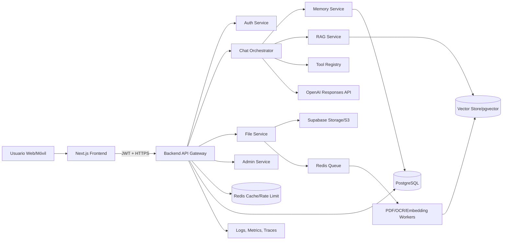

# Plataforma de Chat IA Premium: arquitectura, UX/UI y roadmap

Este documento define la evolución de `abogadord-api` hacia una plataforma de chat IA moderna, escalable y preparada para asistentes legales, RAG documental, agentes especializados y experiencias multimodales tipo ChatGPT, Claude o Perplexity.

## 1. Visión del producto

La plataforma debe ofrecer una experiencia conversacional premium para usuarios finales, abogados, administradores y futuros agentes IA. El objetivo es combinar una interfaz oscura, rápida y elegante con un backend seguro, memoria persistente, recuperación aumentada por documentos y capacidades multimodales.

### Principios de diseño

- **Confianza profesional:** tono visual sobrio, legal-tech, con jerarquía clara y estados explícitos.
- **Velocidad percibida:** streaming token a token, skeleton states, autoscroll inteligente y feedback inmediato.
- **Privacidad por diseño:** separación estricta por usuario/organización, trazabilidad de fuentes y permisos por documento.
- **Escalabilidad empresarial:** arquitectura modular, colas, cache, observabilidad, multi-tenant y componentes desacoplados.
- **Preparación agentic:** tools calling, router de agentes, trazas, políticas de seguridad y memoria estructurada.

## 2. Stack tecnológico recomendado

| Capa | Tecnología | Uso principal |
| --- | --- | --- |
| Frontend | Next.js App Router, React, TypeScript | Aplicación web SSR/SPA híbrida, rutas protegidas y UI reactiva. |
| Estilos | TailwindCSS, shadcn/ui, Radix UI | Design system accesible, oscuro, componible y consistente. |
| Animación | Framer Motion | Transiciones suaves, entrada de mensajes, sidebar y microinteracciones. |
| Estado cliente | Zustand o TanStack Query | Caché de conversaciones, settings, subida de archivos y optimistic UI. |
| Backend API | Node.js con NestJS/Fastify o FastAPI | REST/SSE/WebSocket, auth, chat orchestration, archivos y jobs. |
| IA | OpenAI Responses API | Streaming, texto, imagen como input, tools, file search y web search cuando aplique. |
| Base de datos | PostgreSQL + Supabase | Usuarios, conversaciones, mensajes, settings, auditoría y storage. |
| Vectores | pgvector/Supabase Vector o vector DB dedicada | Memoria semántica, RAG por documentos y búsqueda contextual. |
| Cache/colas | Redis + BullMQ/Celery | Rate limiting, jobs de embeddings, parsing PDF y sesiones efímeras. |
| Archivos | Supabase Storage o S3 compatible | PDFs, imágenes, audios, adjuntos y artefactos generados. |
| Observabilidad | OpenTelemetry, Sentry, Prometheus/Grafana | Logs, métricas, trazas, errores y costos de IA. |
| Deploy | Vercel + Supabase + Redis Cloud/Fly.io/AWS | Cloud ready con crecimiento progresivo. |

> Referencia OpenAI: la Responses API soporta interacciones stateful, entradas de texto/imagen, streaming y herramientas como file search o web search. También se recomienda streaming con eventos semánticos para experiencias tipo chat. Fuentes: `https://platform.openai.com/docs/api-reference/responses` y `https://platform.openai.com/docs/guides/streaming-responses`.

## 3. Arquitectura de alto nivel



### Responsabilidades por servicio

- **Frontend:** chat shell, historial, editor multimodal, render Markdown, streaming UI, dark mode y settings.
- **API Gateway:** autenticación, autorización, rate limits, validación, routing, auditoría y errores normalizados.
- **Chat Orchestrator:** construye contexto, aplica system prompts, consulta memoria/RAG, invoca OpenAI y transmite tokens.
- **Memory Service:** memoria corta, resúmenes de conversación, preferencias del usuario y hechos persistentes verificados.
- **RAG Service:** recuperación semántica/híbrida, ranking, citas, permisos y deduplicación de documentos.
- **File Service:** subida, validación, antivirus, parsing, OCR, chunking, embeddings y estado de indexación.
- **Tool Registry:** herramientas internas para jurisprudencia, documentos, búsqueda web, calendario, pagos o CRM.
- **Admin Service:** métricas, usuarios, costos, logs, prompts, límites, documentos globales y políticas.

## 4. Estructura de proyecto propuesta

```text
abogadord-platform/
├── apps/
│   ├── web/                         # Next.js + React + TailwindCSS
│   │   ├── app/
│   │   │   ├── (auth)/login/page.tsx
│   │   │   ├── (chat)/chat/[conversationId]/page.tsx
│   │   │   ├── admin/page.tsx
│   │   │   └── api/auth/callback/route.ts
│   │   ├── components/
│   │   │   ├── chat/
│   │   │   ├── layout/
│   │   │   ├── markdown/
│   │   │   ├── upload/
│   │   │   └── ui/
│   │   ├── hooks/
│   │   ├── lib/
│   │   ├── stores/
│   │   └── styles/
│   └── api/                         # NestJS/Fastify o FastAPI
│       ├── src/
│       │   ├── auth/
│       │   ├── chat/
│       │   ├── conversations/
│       │   ├── files/
│       │   ├── memory/
│       │   ├── rag/
│       │   ├── tools/
│       │   ├── admin/
│       │   ├── common/
│       │   └── observability/
│       └── test/
├── packages/
│   ├── database/                    # Prisma/Drizzle migrations y tipos
│   ├── prompts/                     # System prompts versionados
│   ├── ai-sdk/                      # Cliente IA interno y contratos
│   ├── config/                      # ESLint, TSConfig, Tailwind preset
│   └── shared/                      # DTOs, schemas Zod, constantes
├── workers/
│   ├── embeddings-worker/
│   ├── pdf-parser-worker/
│   ├── audio-worker/
│   └── analytics-worker/
├── infra/
│   ├── docker-compose.yml
│   ├── terraform/
│   └── vercel/
└── docs/
    ├── arquitectura.md
    ├── api.md
    ├── seguridad.md
    └── prompts.md
```

## 5. UX/UI premium

### Layout principal

- **Sidebar izquierda:** logo, botón “Nuevo chat”, buscador, carpetas, historial agrupado por fecha, favoritos y perfil.
- **Área central:** bienvenida contextual, sugerencias rápidas, conversación, estado de streaming y composer fijo.
- **Panel derecho opcional:** fuentes RAG, memoria aplicada, archivos, herramientas ejecutadas y metadata para usuarios avanzados.
- **Header minimalista:** nombre del chat, modelo activo, botón compartir, exportar, settings y modo foco.

### Componentes UI reutilizables

| Componente | Función |
| --- | --- |
| `AppShell` | Estructura responsive con sidebar colapsable y shortcuts. |
| `ChatSidebar` | Historial, búsqueda, carpetas, renombrar y eliminar conversaciones. |
| `ConversationView` | Renderiza mensajes, fechas, fuentes, tool calls y estados. |
| `MessageBubble` | Burbuja premium con Markdown, acciones, copiar, feedback y edición. |
| `StreamingMessage` | Recibe eventos SSE/WebSocket y actualiza tokens incrementalmente. |
| `Composer` | Textarea auto-resize, adjuntos, voz, comandos `/`, selección de herramientas. |
| `FileDropzone` | Drag & drop, progreso, validación, reintento y estado de indexación. |
| `SourceCitationPanel` | Muestra chunks, documentos, scores, páginas y trazabilidad. |
| `TypingIndicator` | Indicador elegante con shimmer/dots y etiqueta de herramienta activa. |
| `SettingsModal` | Modelo, tono, memoria, privacidad, idioma, voz y preferencias. |
| `AdminDashboard` | Uso, costos, usuarios, errores, prompts, límites y calidad. |

### Dirección visual

- **Tema oscuro futurista:** fondo `#070A12`, superficies `#0E1320`, borde `rgba(255,255,255,.08)` y acentos azul/violeta.
- **Tipografía:** Inter, Geist o SF Pro con tamaños 14-16px para lectura prolongada.
- **Burbujas:** usuario con gradiente sutil; asistente en superficie transparente con borde y sombra suave.
- **Animaciones:** `motion.div` con `opacity`, `y`, `scale` y transiciones de 120-220ms.
- **Markdown:** resaltado de código, tablas, listas, citas, alertas y botones copiar.
- **Accesibilidad:** contraste AA, navegación por teclado, `aria-live` para streaming y targets táctiles de 44px.

## 6. Modelo de datos PostgreSQL

```sql
create table organizations (
  id uuid primary key default gen_random_uuid(),
  name text not null,
  plan text not null default 'free',
  created_at timestamptz not null default now()
);

create table users (
  id uuid primary key default gen_random_uuid(),
  organization_id uuid references organizations(id),
  email citext unique not null,
  full_name text,
  avatar_url text,
  role text not null default 'user',
  created_at timestamptz not null default now(),
  last_seen_at timestamptz
);

create table conversations (
  id uuid primary key default gen_random_uuid(),
  organization_id uuid references organizations(id) not null,
  user_id uuid references users(id) not null,
  title text not null default 'Nuevo chat',
  model text not null,
  status text not null default 'active',
  summary text,
  metadata jsonb not null default '{}',
  created_at timestamptz not null default now(),
  updated_at timestamptz not null default now()
);

create table messages (
  id uuid primary key default gen_random_uuid(),
  conversation_id uuid references conversations(id) on delete cascade not null,
  user_id uuid references users(id),
  role text not null check (role in ('system','user','assistant','tool')),
  content text,
  content_json jsonb not null default '[]',
  token_count integer default 0,
  tool_calls jsonb not null default '[]',
  citations jsonb not null default '[]',
  created_at timestamptz not null default now()
);

create table memories (
  id uuid primary key default gen_random_uuid(),
  organization_id uuid references organizations(id) not null,
  user_id uuid references users(id),
  conversation_id uuid references conversations(id),
  type text not null check (type in ('preference','fact','summary','task','domain')),
  content text not null,
  confidence numeric not null default 0.75,
  embedding vector(1536),
  source_message_id uuid references messages(id),
  expires_at timestamptz,
  created_at timestamptz not null default now()
);

create table files (
  id uuid primary key default gen_random_uuid(),
  organization_id uuid references organizations(id) not null,
  user_id uuid references users(id) not null,
  conversation_id uuid references conversations(id),
  storage_path text not null,
  filename text not null,
  mime_type text not null,
  size_bytes bigint not null,
  status text not null default 'uploaded',
  metadata jsonb not null default '{}',
  created_at timestamptz not null default now()
);

create table document_chunks (
  id uuid primary key default gen_random_uuid(),
  file_id uuid references files(id) on delete cascade not null,
  organization_id uuid references organizations(id) not null,
  content text not null,
  page_start integer,
  page_end integer,
  chunk_index integer not null,
  embedding vector(1536),
  metadata jsonb not null default '{}',
  created_at timestamptz not null default now()
);

create table user_settings (
  user_id uuid primary key references users(id) on delete cascade,
  default_model text,
  theme text not null default 'dark',
  language text not null default 'es',
  memory_enabled boolean not null default true,
  voice_enabled boolean not null default false,
  preferences jsonb not null default '{}',
  updated_at timestamptz not null default now()
);
```

### Índices clave

- `messages(conversation_id, created_at)` para reconstruir chats.
- `conversations(user_id, updated_at desc)` para historial rápido.
- `document_chunks using ivfflat/hnsw (embedding vector_cosine_ops)` para RAG.
- `memories(user_id, type)` y vector index para memoria semántica.
- Row Level Security por `organization_id` y `user_id` en Supabase.

## 7. Endpoints principales

| Método | Endpoint | Descripción |
| --- | --- | --- |
| `POST` | `/auth/login` | Login email/password, magic link o OAuth. |
| `POST` | `/auth/refresh` | Renovación segura de JWT. |
| `GET` | `/conversations` | Lista paginada de conversaciones del usuario. |
| `POST` | `/conversations` | Crea un nuevo chat con modelo/settings. |
| `GET` | `/conversations/:id/messages` | Recupera mensajes y fuentes. |
| `PATCH` | `/conversations/:id` | Renombra, archiva o fija conversación. |
| `DELETE` | `/conversations/:id` | Elimina conversación y mensajes. |
| `POST` | `/chat/stream` | Envía mensaje y devuelve SSE token/evento. |
| `POST` | `/chat/:id/regenerate` | Regenera una respuesta. |
| `POST` | `/files` | Sube PDF, imagen, audio o texto. |
| `GET` | `/files/:id/status` | Estado de parsing, OCR e indexación. |
| `POST` | `/memory` | Crea memoria explícita validada por usuario. |
| `GET` | `/memory` | Lista memorias y preferencias. |
| `DELETE` | `/memory/:id` | Borra memoria. |
| `GET` | `/settings` | Obtiene configuración del usuario. |
| `PATCH` | `/settings` | Actualiza modelo, tema, voz, memoria y privacidad. |
| `GET` | `/admin/analytics` | Uso, costos, latencia, errores y retención. |

### Contrato SSE sugerido para streaming

```text
event: message.created
data: {"messageId":"...","conversationId":"..."}

event: token.delta
data: {"text":"Hola"}

event: tool.started
data: {"name":"file_search","input":{}}

event: citation.added
data: {"fileId":"...","page":4,"quote":"..."}

event: message.completed
data: {"messageId":"...","usage":{"input_tokens":1200,"output_tokens":420}}

event: error
data: {"code":"rate_limited","message":"Intenta nuevamente en unos segundos."}
```

## 8. Flujo completo de IA

1. **Usuario envía mensaje:** el frontend crea un mensaje optimista y abre conexión SSE a `/chat/stream`.
2. **Validación:** backend verifica JWT, permisos, plan, tamaño, adjuntos y límites.
3. **Carga de contexto:** se recuperan últimos mensajes, resumen conversacional, settings, memorias relevantes y documentos adjuntos.
4. **RAG:** si hay archivos o intención de búsqueda documental, se consultan chunks vectoriales/híbridos con filtros por usuario/organización.
5. **Prompt assembly:** se compone `system prompt`, instrucciones de seguridad, contexto legal, memoria, fuentes y mensaje actual.
6. **OpenAI Responses API:** se invoca con streaming y herramientas declaradas para web search, file search o funciones internas.
7. **Tool calling:** si el modelo solicita una herramienta, el orquestador ejecuta la función, valida salida y reinyecta resultado.
8. **Streaming:** se transmiten tokens, tool events, citas y estados al cliente.
9. **Persistencia:** al finalizar, se guardan mensaje, uso de tokens, citas, trazas, costos y feedback pendiente.
10. **Actualización de memoria:** worker analiza si hay hechos/preferencias memorables, pide confirmación cuando sea sensible y actualiza memoria.

## 9. Sistema de memoria

### Tipos de memoria

- **Memoria de sesión:** últimos N mensajes y estado temporal del chat.
- **Resumen conversacional:** condensado incremental para chats largos.
- **Memoria de usuario:** preferencias, estilo, idioma, intereses y restricciones aprobadas.
- **Memoria semántica:** hechos y documentos indexados con embeddings.
- **Memoria organizacional:** conocimiento compartido por una firma, con permisos y auditoría.

### Políticas de memoria

- Guardar solo información útil, verificable y no sensible por defecto.
- Permitir activar/desactivar memoria desde settings.
- Mostrar “Memoria usada” en el panel derecho para transparencia.
- Implementar caducidad (`expires_at`) para datos temporales.
- Dar control de editar/borrar memorias al usuario.
- Usar umbrales de confianza y confirmación para datos personales o legales sensibles.

## 10. Sistema RAG y documentos

### Pipeline PDF

1. Subida con validación de MIME, tamaño y malware scan.
2. Extracción de texto con parser PDF; OCR si es escaneado.
3. Normalización: páginas, encabezados, pies, tablas y metadatos.
4. Chunking por secciones semánticas con overlap controlado.
5. Embeddings y almacenamiento en vector DB.
6. Estado visible: `uploaded`, `processing`, `indexed`, `failed`.
7. Recuperación con filtros por `organization_id`, `conversation_id`, `file_id` y permisos.
8. Respuesta con citas: documento, página, chunk y score.

### Estrategia de recuperación

- Búsqueda híbrida: vectorial + keyword para términos legales exactos.
- Reranking por relevancia, fecha, autoridad y permisos.
- Deduplicación de chunks similares.
- Citas obligatorias cuando la respuesta use documentos.
- Fallback: si no hay evidencia suficiente, el asistente debe reconocer limitaciones.

## 11. Seguridad, privacidad y cumplimiento

- JWT de corta duración + refresh tokens rotables.
- Rate limiting por usuario, IP, organización y endpoint.
- Validación con Zod/Pydantic y sanitización de Markdown/HTML.
- RLS en Supabase y separación multi-tenant por `organization_id`.
- Cifrado en tránsito y reposo.
- Auditoría para login, mensajes, archivos, herramientas y administración.
- Secret management fuera del repositorio.
- Redacción de PII en logs y trazas.
- Moderación de archivos y prompts maliciosos.
- Backups automáticos y pruebas de recuperación.

## 12. Funciones premium

| Función | MVP | Evolución |
| --- | --- | --- |
| PDF upload | Subir, parsear, indexar y citar PDFs. | OCR avanzado, tablas, firmas y comparación documental. |
| Voz | Dictado en composer. | Realtime voice, interrupciones y llamadas. |
| Texto a voz | Leer respuestas. | Voces por marca, velocidad y streaming audio. |
| Imágenes | Input de imagen para análisis. | Generación de imágenes y diagramas. |
| Búsqueda web | Tool opcional con citas. | Modo investigación con ranking y síntesis. |
| Analíticas | Tokens, latencia, chats, errores. | Calidad, cohortes, costos por cliente y alertas. |
| Admin dashboard | Gestión de usuarios y límites. | Prompt ops, evals, A/B testing y auditoría avanzada. |
| Agentes | Router básico por intención. | Multi-agent planner, handoffs, trazas y permisos por tool. |

## 13. Roadmap de desarrollo

### Fase 0: Fundaciones (1-2 semanas)

- Monorepo, CI, lint, tests, Docker local y variables de entorno.
- Design tokens, Tailwind, shadcn/ui, tema oscuro y layout base.
- Esquemas DB, migraciones, Supabase auth/storage y RLS inicial.

### Fase 1: Chat MVP (2-4 semanas)

- Login, conversaciones, mensajes, historial y composer.
- Streaming SSE con OpenAI Responses API.
- Markdown, bloques de código, copiar, feedback y regenerar.
- Persistencia de mensajes, usage y errores.

### Fase 2: Memoria y RAG (3-5 semanas)

- Resúmenes conversacionales y memoria de usuario editable.
- Subida de PDF, workers, embeddings, vector search y citas.
- Panel de fuentes y estado de indexación.
- Evaluaciones de calidad y pruebas con documentos legales.

### Fase 3: Premium y administración (4-6 semanas)

- Voz, TTS, imágenes, búsqueda web y settings avanzados.
- Dashboard admin, analíticas, límites por plan y costos.
- Observabilidad completa, alertas y auditoría.

### Fase 4: Agentes IA empresariales (6-10 semanas)

- Tool registry versionado y permisos por herramienta.
- Router multiagente: investigación, redacción, análisis, revisión y soporte.
- Trazas agentic, colas de tareas largas, human-in-the-loop y evals continuas.

## 14. Estrategia de escalabilidad

- **Escala horizontal:** API stateless detrás de load balancer; sesiones en Redis/Postgres.
- **Backpressure:** colas para PDF, OCR, embeddings, audio y analíticas.
- **Cache:** conversaciones recientes, settings, rate limits y resultados RAG frecuentes.
- **Particionado:** tablas grandes por organización/fecha si el volumen crece.
- **Cost control:** límites por plan, budgets, selección dinámica de modelo y compresión de contexto.
- **Observabilidad:** latencia p50/p95/p99, tokens, errores por modelo, tool failures y costos por tenant.
- **Calidad:** evals automáticas con datasets legales, golden answers, pruebas RAG y revisión humana.
- **Disaster recovery:** backups, restore drills, versionado de prompts y migraciones reversibles.

## 15. MVP recomendado para este repositorio

Para evolucionar desde la API serverless actual, el primer incremento debe ser pequeño y valioso:

1. Mantener endpoints legales existentes como tools internas.
2. Añadir un endpoint `/api/chat_stream` con SSE y OpenAI.
3. Crear tablas `users`, `conversations`, `messages` y `user_settings` en Supabase.
4. Implementar frontend Next.js en `apps/web` o repositorio separado.
5. Añadir subida de PDF como fase posterior con worker e índice vectorial.
6. Instrumentar logs, rate limit y métricas antes de abrir beta pública.
